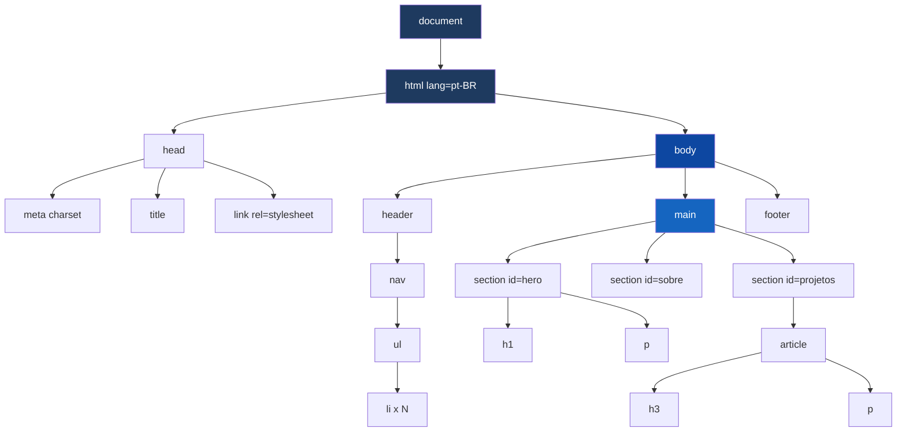
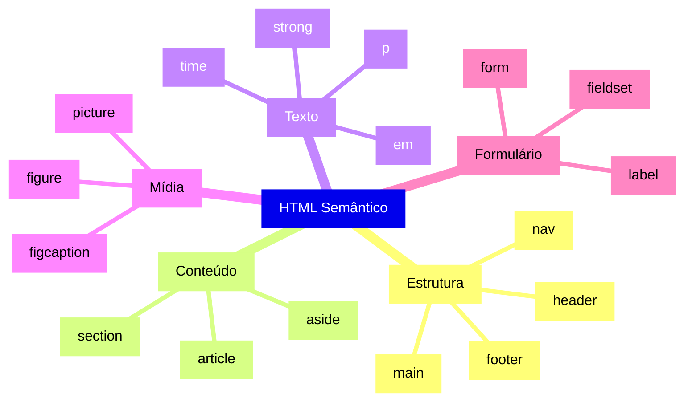
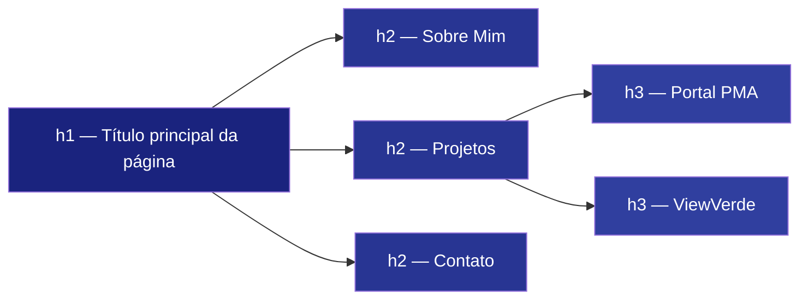
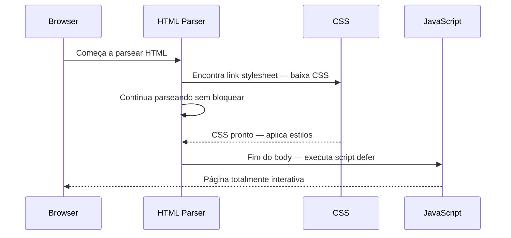
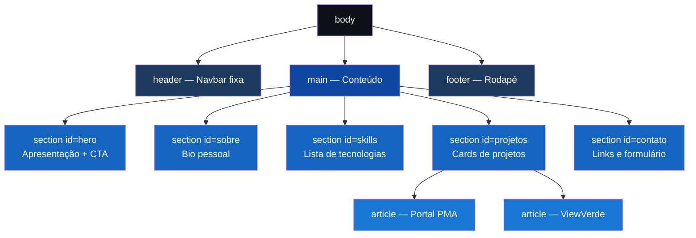

# 📖 Apostila de HTML Semântico — Guia Completo

> **Para quem é isso?** Dev em formação que quer entender HTML de verdade — não só a sintaxe, mas a **arquitetura** por trás de um documento bem construído.

---

## Sumário

1. [O que é HTML e qual seu papel na trindade web](#1-o-que-é-html-e-qual-seu-papel-na-trindade-web)
2. [Arquitetura de um Documento HTML](#2-arquitetura-de-um-documento-html)
3. [A Árvore DOM — Como o Browser Enxerga seu HTML](#3-a-árvore-dom--como-o-browser-enxerga-seu-html)
4. [O Modelo Mental em 3 Perguntas](#4-o-modelo-mental-em-3-perguntas)
5. [Tags Semânticas × Tags Genéricas](#5-tags-semânticas--tags-genéricas)
6. [Hierarquia de Headings](#6-hierarquia-de-headings)
7. [Links e Âncoras](#7-links-e-âncoras)
8. [Imagens e Figuras](#8-imagens-e-figuras)
9. [Listas](#9-listas)
10. [Formulários](#10-formulários)
11. [Acessibilidade — ARIA e Boas Práticas](#11-acessibilidade--aria-e-boas-práticas)
12. [SEO — Metadados Avançados](#12-seo--metadados-avançados)
13. [Performance — Carregamento Inteligente](#13-performance--carregamento-inteligente)
14. [Padrões de Layout Semântico](#14-padrões-de-layout-semântico)
15. [Blueprint Completo — Portfólio](#15-blueprint-completo--portfólio)
16. [Checklist de Qualidade](#16-checklist-de-qualidade)
17. [Boas Práticas — Resumo](#17-boas-práticas--resumo)

---

## 1. O que é HTML e qual seu papel na trindade web

HTML (**H**yper**T**ext **M**arkup **L**anguage) é a linguagem que **estrutura e dá significado** ao conteúdo de uma página web.

A trindade do frontend funciona assim:

| Camada | Tecnologia | Analogia |
|--------|-----------|---------|
| **Estrutura** | HTML | Esqueleto da casa (vigas, paredes) |
| **Visual** | CSS | Acabamento (tinta, móveis, iluminação) |
| **Comportamento** | JavaScript | Automações (ar-condicionado, alarme, portas automáticas) |

> **Insight importante:** Uma página com HTML semântico perfeito deve fazer sentido **sem CSS nenhum**. Se remover o CSS e o conteúdo ficar caótico, o HTML está mal estruturado.

---

## 2. Arquitetura de um Documento HTML

Todo arquivo `.html` possui duas grandes zonas:

```html
<!DOCTYPE html>
<html lang="pt-BR">

  <!-- ═══════════════════════════════════════
       ZONA 1: HEAD — Metadados (invisível ao usuário)
       Configura o documento para browsers, bots e SEO
  ═══════════════════════════════════════ -->
  <head>
    <meta charset="UTF-8">
    <meta name="viewport" content="width=device-width, initial-scale=1.0">
    <meta name="description" content="Descrição da página para o Google">
    <meta name="author" content="Vinicius Menegussi">
    <title>Título que aparece na aba e no Google</title>

    <!-- Fontes externas (Google Fonts) -->
    <link rel="preconnect" href="https://fonts.googleapis.com">
    <link rel="stylesheet" href="https://fonts.googleapis.com/css2?family=Inter:wght@400;700&display=swap">

    <!-- CSS da página -->
    <link rel="stylesheet" href="style.css">
  </head>

  <!-- ═══════════════════════════════════════
       ZONA 2: BODY — Conteúdo (tudo que o usuário VÊ)
       Dividido em regiões semânticas
  ═══════════════════════════════════════ -->
  <body>

    <header>...</header>   <!-- Cabeçalho global -->
    <main>...</main>       <!-- Conteúdo principal único -->
    <footer>...</footer>   <!-- Rodapé global -->

    <!-- Scripts no FINAL para não bloquear o carregamento -->
    <script src="script.js"></script>
  </body>

</html>
```

### Por que o `<script>` fica no final do body?

```
Carregamento da página:
──────────────────────────────────────────────────────►
  Parse HTML  →  Encontra <script>  →  PARA tudo  →  Baixa JS  →  Continua HTML

  ❌ Script no <head>: usuário vê tela branca por mais tempo

  ✅ Script no final do <body>: HTML carrega primeiro, JS depois
     → Usuário vê o conteúdo imediatamente
```

---

## 3. A Árvore DOM — Como o Browser Enxerga seu HTML

Quando o browser lê seu HTML, ele constrói uma estrutura chamada **DOM (Document Object Model)** — uma árvore de nós onde cada tag é um nó.



> **Por que isso importa?** JavaScript acessa o DOM para manipular elementos. CSS usa a árvore para aplicar estilos. Leitores de tela navegam pelo DOM. **Um DOM bem estruturado = página mais rápida, acessível e fácil de manter.**

---

## 4. O Modelo Mental em 3 Perguntas

Antes de escrever qualquer tag, faça essas 3 perguntas:

### ❓ Pergunta 1: Qual é o PROPÓSITO desse bloco?

```
Navegação entre páginas?         → <nav>
Cabeçalho da página/seção?       → <header>
Conteúdo central único?          → <main>
Grupo com tema próprio?          → <section>  (precisa ter heading)
Conteúdo independente?           → <article>  (faz sentido sozinho)
Conteúdo complementar/lateral?   → <aside>
Informação de contato?           → <address>
Rodapé?                          → <footer>
Só agrupar visualmente?          → <div>      (sem semântica)
Texto inline sem semântica?      → <span>     (sem semântica)
```

### ❓ Pergunta 2: Qual é a HIERARQUIA?

```
Pense sempre de fora para dentro:

html
└── body
    ├── header          ← nível 1 (global)
    │   └── nav         ← nível 2
    │       └── ul      ← nível 3
    │           └── li  ← nível 4
    ├── main            ← nível 1 (global)
    │   └── section     ← nível 2
    │       └── article ← nível 3
    └── footer          ← nível 1 (global)
```

### ❓ Pergunta 3: Isso precisa de SEMÂNTICA ou é só layout?

```
Tem significado próprio?
├── SIM → Use tag semântica (<nav>, <article>, <section>...)
└── NÃO → Use <div> (container sem significado)

É texto inline que precisa de estilo?
├── SIM → Use <span>
└── NÃO → Use tag semântica de texto (<strong>, <em>, <time>...)
```

---

## 5. Tags Semânticas × Tags Genéricas

### O antes e depois clássico

```html
<!-- ❌ "Divsoup" — Funciona, mas sem significado algum -->
<div class="topo">
  <div class="menu">
    <div class="menu-item"><a href="#">Home</a></div>
  </div>
</div>
<div class="pagina">
  <div class="secao-principal">
    <div class="titulo-grande">Vinicius Menegussi</div>
  </div>
</div>
<div class="rodape">...</div>

<!-- ✅ HTML Semântico — Estrutura com significado -->
<header>
  <nav>
    <ul>
      <li><a href="#hero">Home</a></li>
    </ul>
  </nav>
</header>
<main>
  <section id="hero">
    <h1>Vinicius Menegussi</h1>
  </section>
</main>
<footer>...</footer>
```

### Mindmap de Tags Semânticas



### Tabela de referência rápida

| Tag | Significado semântico | Regra de uso |
|-----|-----------------------|-------------|
| `<header>` | Cabeçalho | Pode haver vários (um por `<article>` também) |
| `<nav>` | Navegação principal | Use para menus de links importantes |
| `<main>` | Conteúdo central | **Somente 1 por página** |
| `<section>` | Seção temática | Sempre deve ter um heading |
| `<article>` | Conteúdo independente | Deve fazer sentido fora do contexto da página |
| `<aside>` | Conteúdo complementar | Sidebar, notas, anúncios relacionados |
| `<footer>` | Rodapé | Pode haver vários (um por `<article>` também) |
| `<figure>` | Figura referenciada | Imagem, diagrama, código — com legenda opcional |
| `<figcaption>` | Legenda da figura | Sempre filho direto de `<figure>` |
| `<address>` | Informação de contato | Contato do autor ou dono do `<article>` |
| `<time>` | Data/hora | Usar atributo `datetime` para máquinas |
| `<mark>` | Destaque/highlight | Texto relevante no contexto atual |
| `<details>` | Conteúdo expansível | Accordions sem JavaScript |
| `<summary>` | Título do `<details>` | O texto clicável que expande o bloco |

---

## 6. Hierarquia de Headings

Headings definem o **outline** (esqueleto de títulos) da página.



**Regras de ouro:**

```html
<!-- ✅ Correto: 1 h1, hierarquia respeitada -->
<h1>Vinicius Menegussi — Fullstack Developer</h1>
  <h2>Sobre Mim</h2>
  <h2>Projetos</h2>
    <h3>Portal PMA</h3>
    <h3>ViewVerde</h3>
  <h2>Contato</h2>

<!-- ❌ Errado: múltiplos h1 -->
<h1>Vinicius Menegussi</h1>
<h1>Sobre Mim</h1>   <!-- 🚨 Segundo h1! -->

<!-- ❌ Errado: pular nível -->
<h1>Título</h1>
<h3>Subtítulo</h3>  <!-- 🚨 Pulou o h2! -->
```

---

## 7. Links e Âncoras

```html
<!-- Link externo: abre nova aba com segurança -->
<a href="https://github.com/V1ni0menega"
   target="_blank"
   rel="noopener noreferrer">
  GitHub
</a>

<!-- Link interno: scroll suave para a section -->
<a href="#projetos">Ver Projetos</a>
<section id="projetos">...</section>

<!-- Link de email -->
<a href="mailto:vinicius@email.com">vinicius@email.com</a>

<!-- Link de telefone (útil em mobile) -->
<a href="tel:+5551999999999">+55 51 99999-9999</a>

<!-- Link para download -->
<a href="./assets/curriculo.pdf" download="Curriculo-Vinicius.pdf">
  Download CV
</a>
```

> **Segurança:** `rel="noopener noreferrer"` em links `target="_blank"` impede que a nova aba acesse `window.opener` — uma vulnerabilidade real chamada **reverse tabnapping**.

---

## 8. Imagens e Figuras

### Imagem simples

```html

```

### Figura com legenda (semântica correta)

```html
<figure>
  
  <figcaption>Portal PMA — Interface de serviços digitais da Prefeitura de Esteio</figcaption>
</figure>
```

### Imagem responsiva com `<picture>`

```html
<!-- Serve imagem diferente dependendo do tamanho de tela -->
<picture>
  <source media="(max-width: 600px)" srcset="./assets/avatar-mobile.jpg">
  <source media="(min-width: 601px)" srcset="./assets/avatar-desktop.jpg">
  
</picture>
```

| Atributo | Para que serve |
|----------|---------------|
| `src` | Caminho da imagem |
| `alt` | Descrição (obrigatório para acessibilidade) |
| `width` / `height` | Evita layout shift (CLS) |
| `loading="lazy"` | Só carrega quando entra na viewport |

---

## 9. Listas

```html
<!-- Lista não-ordenada: skills, features, benefícios -->
<ul>
  <li>Java</li>
  <li>Spring Boot</li>
  <li>Angular</li>
</ul>

<!-- Lista ordenada: passos, ranking, processo -->
<ol>
  <li>Estrutura HTML</li>
  <li>Estilos CSS</li>
  <li>Interações JS</li>
</ol>

<!-- Lista de definição: glossário, especificações -->
<dl>
  <dt>HTML</dt>
  <dd>Linguagem de marcação para estrutura web</dd>

  <dt>CSS</dt>
  <dd>Linguagem de estilos para visual web</dd>
</dl>
```

---

## 10. Formulários

Formulários são uma das partes mais importantes de acessibilidade no HTML.

```html
<form id="form-contato" action="#" method="post" novalidate>

  <!-- fieldset agrupa campos relacionados -->
  <fieldset>
    <legend>Envie uma mensagem</legend>

    <!-- label SEMPRE associado ao input pelo atributo for/id -->
    <div>
      <label for="campo-nome">Nome *</label>
      <input
        type="text"
        id="campo-nome"
        name="nome"
        placeholder="Seu nome completo"
        required
        autocomplete="name"
      >
    </div>

    <div>
      <label for="campo-email">Email *</label>
      <input
        type="email"
        id="campo-email"
        name="email"
        placeholder="seu@email.com"
        required
        autocomplete="email"
      >
    </div>

    <div>
      <label for="campo-mensagem">Mensagem *</label>
      <textarea
        id="campo-mensagem"
        name="mensagem"
        rows="5"
        placeholder="Escreva sua mensagem..."
        required
      ></textarea>
    </div>

    <button type="submit">Enviar Mensagem</button>
  </fieldset>

</form>
```

> **Regra crítica:** Nunca use `<input>` sem `<label>`. Leitores de tela não sabem o que é o campo sem a label associada pelo `for` ↔ `id`.

---

## 11. Acessibilidade — ARIA e Boas Práticas

ARIA (**A**ccessible **R**ich **I**nternet **A**pplications) são atributos que adicionam significado semântico extra para tecnologias assistivas.

```html
<!-- aria-label: nome acessível para elementos sem texto visível -->
<button aria-label="Fechar menu">✕</button>

<!-- aria-hidden: esconde elemento de leitores de tela -->
<span aria-hidden="true">🚀</span> Meus Projetos

<!-- role: define o papel semântico do elemento -->
<div role="alert">Formulário enviado com sucesso!</div>

<!-- aria-expanded: estado de elementos expansíveis -->
<button aria-expanded="false" aria-controls="menu-mobile">
  ☰ Menu
</button>
<nav id="menu-mobile" aria-hidden="true">...</nav>

<!-- aria-current: indica item ativo na navegação -->
<nav>
  <a href="#hero" aria-current="page">Home</a>
  <a href="#projetos">Projetos</a>
</nav>

<!-- Skip link: permite pular para o conteúdo principal -->
<a href="#main-content" class="skip-link">Pular para o conteúdo</a>
<main id="main-content">...</main>
```

### Princípios WCAG resumidos

| Princípio | O que significa | Exemplo prático |
|-----------|----------------|----------------|
| **Perceptível** | O conteúdo pode ser percebido | `alt` em imagens, legendas em vídeos |
| **Operável** | Pode ser operado pelo teclado | Todos os links/botões funcionam com Tab |
| **Compreensível** | O conteúdo faz sentido | Labels em formulários, mensagens de erro claras |
| **Robusto** | Funciona com tecnologias assistivas | HTML semântico correto, ARIA válido |

---

## 12. SEO — Metadados Avançados

```html
<head>
  <!-- Básicos -->
  <meta charset="UTF-8">
  <meta name="viewport" content="width=device-width, initial-scale=1.0">
  <meta name="description" content="Portfólio de Vinicius Menegussi — Desenvolvedor Fullstack Java + Angular">
  <meta name="author" content="Vinicius Menegussi Ramos">
  <title>Vinicius Menegussi | Fullstack Developer</title>

  <!-- Open Graph: aparência no LinkedIn, WhatsApp ao compartilhar -->
  <meta property="og:title" content="Vinicius Menegussi | Fullstack Developer">
  <meta property="og:description" content="Desenvolvedor Fullstack especialista em Java + Angular.">
  <meta property="og:image" content="https://seudominio.com/assets/og-image.jpg">
  <meta property="og:url" content="https://seudominio.com">
  <meta property="og:type" content="website">
  <meta property="og:locale" content="pt_BR">

  <!-- Canonical: evita conteúdo duplicado -->
  <link rel="canonical" href="https://seudominio.com">

  <!-- Favicon -->
  <link rel="icon" type="image/png" href="./assets/favicon.png">
</head>
```

---

## 13. Performance — Carregamento Inteligente

```html
<!-- Preconnect: conecta no servidor da fonte antes de precisar -->
<link rel="preconnect" href="https://fonts.googleapis.com">
<link rel="preconnect" href="https://fonts.gstatic.com" crossorigin>

<!-- Preload: pré-carrega recursos críticos -->
<link rel="preload" href="./assets/avatar.jpg" as="image">

<!-- Script: defer vs async -->
<script src="script.js" defer></script>    <!-- Executa APÓS o HTML ser parseado -->
<script src="analytics.js" async></script> <!-- Executa assim que baixar -->

<!-- Imagens: lazy loading nativo -->


<!-- Imagem acima da dobra: sempre eager (default) -->

```



---

## 14. Padrões de Layout Semântico

### Padrão: Portfólio Single Page (seu caso)



### Padrão: Blog / Lista de Posts

```html
<main>
  <section id="posts">
    <h1>Blog</h1>

    <!-- Cada post é um article independente -->
    <article>
      <header>
        <h2><a href="/posts/html-semantico">HTML Semântico na prática</a></h2>
        <time datetime="2026-09-15">15 de setembro de 2026</time>
      </header>
      <p>Resumo do post...</p>
      <footer>
        <address>Por <a rel="author" href="/sobre">Vinicius Menegussi</a></address>
      </footer>
    </article>

  </section>
</main>
```

---

## 15. Blueprint Completo — Portfólio

```html
<!DOCTYPE html>
<html lang="pt-BR">
<head>
  <meta charset="UTF-8">
  <meta name="viewport" content="width=device-width, initial-scale=1.0">
  <meta name="description" content="Portfólio de Vinicius Menegussi Ramos — Desenvolvedor Fullstack Java + Angular">
  <meta name="author" content="Vinicius Menegussi Ramos">
  <meta property="og:title" content="Vinicius Menegussi | Fullstack Developer">
  <meta property="og:type" content="website">
  <title>Vinicius Menegussi | Fullstack Developer</title>
  <link rel="preconnect" href="https://fonts.googleapis.com">
  <link rel="stylesheet" href="https://fonts.googleapis.com/css2?family=Inter:wght@400;500;700&display=swap">
  <link rel="stylesheet" href="style.css">
</head>
<body>

  <!-- Skip link para acessibilidade -->
  <a href="#conteudo-principal" class="skip-link">Pular para o conteúdo</a>

  <!-- NAVEGAÇÃO -->
  <header>
    <nav id="navbar" aria-label="Navegação principal">
      <a href="#hero" class="logo" aria-label="Ir ao início">VM</a>
      <button id="btn-menu-mobile" aria-expanded="false" aria-controls="menu-links" aria-label="Abrir menu">
        ☰
      </button>
      <ul id="menu-links" role="list">
        <li><a href="#hero" aria-current="page">Home</a></li>
        <li><a href="#sobre">Sobre</a></li>
        <li><a href="#skills">Skills</a></li>
        <li><a href="#projetos">Projetos</a></li>
        <li><a href="#contato">Contato</a></li>
      </ul>
    </nav>
  </header>

  <!-- CONTEÚDO PRINCIPAL -->
  <main id="conteudo-principal">

    <!-- HERO: Apresentação -->
    <section id="hero" aria-labelledby="hero-titulo">
      <figure>
        
      </figure>
      <h1 id="hero-titulo">Vinicius Menegussi Ramos</h1>
      <p>Fullstack Developer · Java · Angular · Spring Boot</p>
      <nav aria-label="Ações rápidas">
        <a href="#projetos">Ver Projetos</a>
        <a href="./assets/curriculo.pdf" download="Curriculo-Vinicius.pdf">Download CV</a>
      </nav>
    </section>

    <!-- SOBRE: Bio -->
    <section id="sobre" aria-labelledby="sobre-titulo">
      <h2 id="sobre-titulo">Sobre Mim</h2>
      <p>
        Desenvolvedor Fullstack em formação pela <strong>Residência TIC Softex (ResTIC55)</strong>,
        com experiência prática em Java, Spring Boot e Angular.
        Apaixonado por resolver problemas reais com tecnologia —
        como o <em>Portal PMA</em>, que digitalizou serviços municipais de Esteio.
      </p>
    </section>

    <!-- SKILLS: Tecnologias -->
    <section id="skills" aria-labelledby="skills-titulo">
      <h2 id="skills-titulo">Tecnologias</h2>
      <ul role="list" aria-label="Lista de tecnologias">
        <li>Java</li>
        <li>Spring Boot</li>
        <li>Angular</li>
        <li>TypeScript</li>
        <li>Docker</li>
        <li>PostgreSQL</li>
        <li>MySQL</li>
        <li>Git</li>
      </ul>
    </section>

    <!-- PROJETOS: Cards -->
    <section id="projetos" aria-labelledby="projetos-titulo">
      <h2 id="projetos-titulo">Projetos</h2>

      <article class="card-projeto" aria-labelledby="pma-titulo">
        <h3 id="pma-titulo">Portal PMA — Prefeitura de Esteio</h3>
        <p>
          Portal público desenvolvido com Angular 21 e Spring Boot.
          Resolve a dor real de acesso a serviços municipais online para os cidadãos de Esteio/RS.
        </p>
        <ul aria-label="Tecnologias usadas">
          <li>Angular 21</li>
          <li>Spring Boot</li>
          <li>Docker</li>
          <li>PostgreSQL</li>
        </ul>
        <a href="https://github.com/V1ni0menega" target="_blank" rel="noopener noreferrer"
           aria-label="Ver Portal PMA no GitHub">
          Ver no GitHub
        </a>
      </article>

      <article class="card-projeto" aria-labelledby="viewverde-titulo">
        <h3 id="viewverde-titulo">ViewVerde</h3>
        <p>
          Site institucional de dados ambientais com 4 módulos de monitoramento,
          contraste WCAG AA e parceiros Esteio/Unisinos/Dell/ResTIC55.
        </p>
        <ul aria-label="Tecnologias usadas">
          <li>Eleventy (11ty)</li>
          <li>HTML Semântico</li>
          <li>CSS</li>
        </ul>
        <a href="https://github.com/V1ni0menega" target="_blank" rel="noopener noreferrer"
           aria-label="Ver ViewVerde no GitHub">
          Ver no GitHub
        </a>
      </article>

    </section>

    <!-- CONTATO -->
    <section id="contato" aria-labelledby="contato-titulo">
      <h2 id="contato-titulo">Contato</h2>
      <address>
        <a href="https://github.com/V1ni0menega" target="_blank" rel="noopener noreferrer">GitHub</a>
        <a href="https://linkedin.com/in/vinicius-menegussi" target="_blank" rel="noopener noreferrer">LinkedIn</a>
        <a href="mailto:vinicius@email.com">vinicius@email.com</a>
      </address>
    </section>

  </main>

  <!-- RODAPÉ -->
  <footer>
    <p><small>© 2026 Vinicius Menegussi Ramos. Feito com HTML, CSS e JS.</small></p>
  </footer>

  <script src="script.js" defer></script>
</body>
</html>
```

---

## 16. Checklist de Qualidade

### ✅ Documento Base
- [ ] `<!DOCTYPE html>` presente
- [ ] `<html lang="pt-BR">` com idioma correto
- [ ] `<meta charset="UTF-8">`
- [ ] `<meta name="viewport" content="width=device-width, initial-scale=1.0">`
- [ ] `<meta name="description">` com texto descritivo
- [ ] `<title>` descritivo e único

### ✅ Semântica
- [ ] Somente **1 `<main>`** na página
- [ ] Somente **1 `<h1>`** na página
- [ ] Hierarquia de headings sem pular níveis
- [ ] Todas as `<section>` têm heading (`<h2>`, `<h3>`...)
- [ ] Cards de projeto usam `<article>`, não `<div>`
- [ ] Contatos dentro de `<address>`

### ✅ Navegação
- [ ] Links do `<nav>` apontam para `id`s corretos
- [ ] Skip link para acessibilidade (`<a href="#main">`)

### ✅ Imagens
- [ ] Toda `` tem `alt` descritivo
- [ ] Imagens têm `width` e `height` definidos
- [ ] Imagens fora da viewport têm `loading="lazy"`

### ✅ Links
- [ ] Links externos têm `rel="noopener noreferrer"`
- [ ] Links externos têm `target="_blank"`
- [ ] Sem `href="#"` que não leva a lugar nenhum

### ✅ Performance
- [ ] `<script>` no final do `<body>` ou com `defer`
- [ ] Google Fonts com `rel="preconnect"`

### ✅ Acessibilidade
- [ ] Elementos interativos têm `aria-label` quando necessário
- [ ] Formulários com `<label>` associada ao `<input>`

---

## 17. Boas Práticas — Resumo

| ✅ Faça | ❌ Evite | 💡 Por quê |
|---------|---------|------------|
| Use tags semânticas | Usar só `<div>` | Semântica melhora SEO e acessibilidade |
| 1 `<h1>` por página | Múltiplos `<h1>` | Confunde o Google e leitores de tela |
| Respeitar hierarquia h1→h2→h3 | Pular níveis (h1→h4) | O outline da página fica quebrado |
| `alt` descritivo em imagens | `alt=""` ou sem alt | Acessibilidade para deficientes visuais |
| `<script defer>` ou no fim do body | `<script>` no `<head>` sem defer | Bloqueia o carregamento da página |
| `href="#id"` no nav | `href="#"` em branco | Links sem destino são inacessíveis |
| `rel="noopener"` em links externos | Links externos sem proteção | Vulnerabilidade reverse tabnapping |
| `lang="pt-BR"` correto | `lang="en"` em pt-BR | Leitores de tela pronunciam errado |
| `<label for="id">` em formulários | Input sem label | Campo não identificável |
| `loading="lazy"` em imagens | Carregar tudo de uma vez | Melhora performance |
| `<article>` para cards | `<div class="card">` | Card de projeto é conteúdo independente |
| `<address>` para contatos | `<div class="contato">` | Semântica correta de dados de contato |

---

*Apostila criada durante a Residência TIC Fullstack — ResTIC55 · Setembro/2026*  
*Vinicius Menegussi Ramos · Mentor: Antigravity AI*
